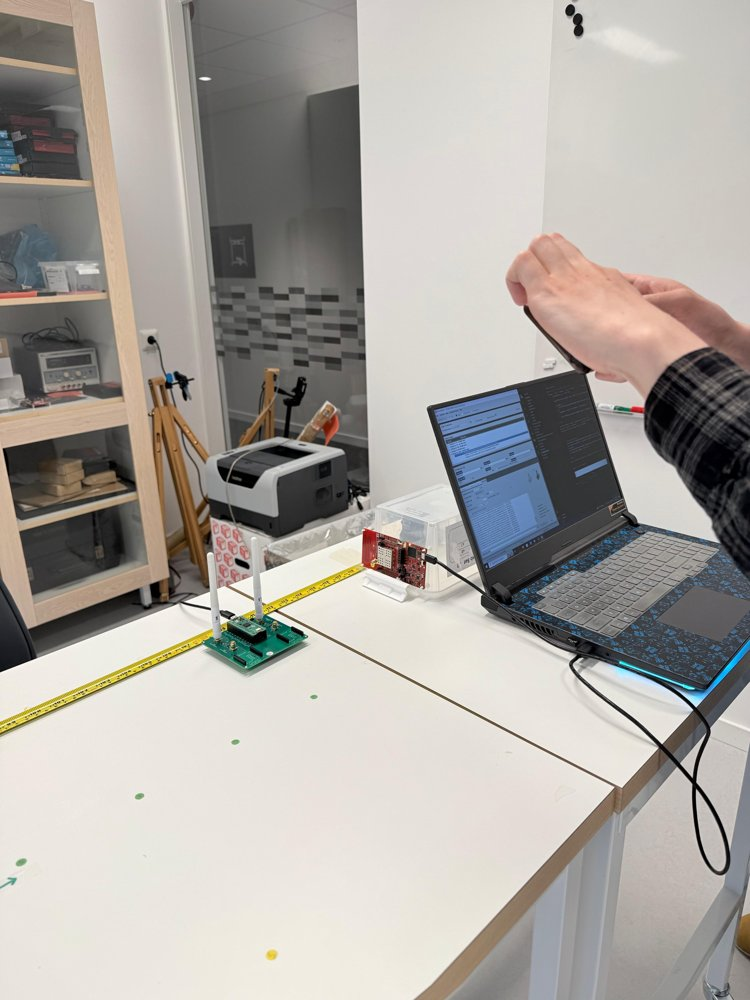
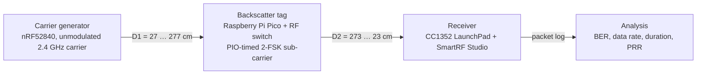
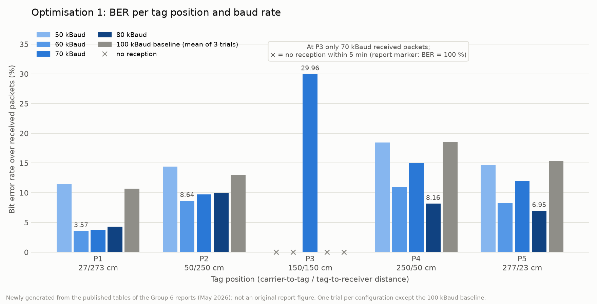
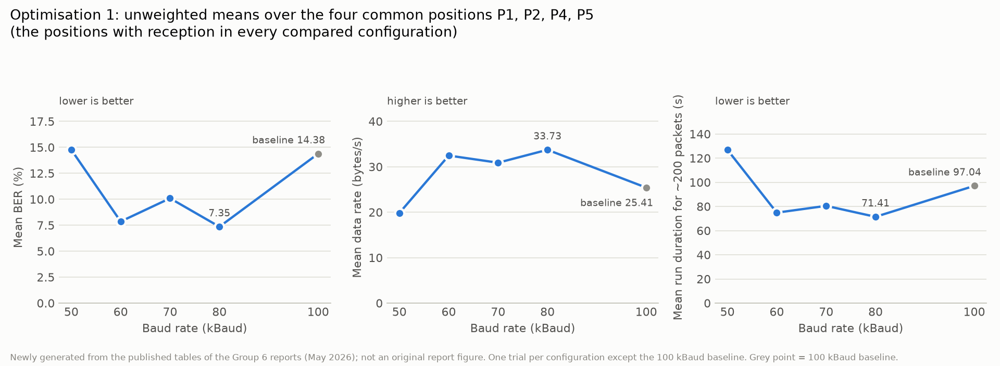

# Backscatter Reliability: Experimental Optimization and Error-Control Analysis

An experimental study of the reliability of a 2.4 GHz backscatter link, built on the
Pico-Backscatter teaching platform of Uppsala University's course *Wireless
Communication and Networked Embedded Systems* (1DT195, spring 2026). Two laboratory
optimisations by Group 6 varied the tag's baud rate and packet length across five tag
positions and measured bit error rate, effective data rate and run duration. An
individual analytical study by Padmaja Pabbathi then examined what payload-level
forward error correction and interleaving could add.

**Research question.** A backscatter tag does not transmit; it modulates a carrier that
another node generates, so the received signal depends on two cascaded links and is
weakest midway between carrier and receiver. Which physical-layer settings, baud rate
and packet length, give the most reliable link across tag positions, and what would
error control add on top?

## Key findings

* **Measured:** lowering the baud rate from 100 kBaud to 60–80 kBaud reduced the bit
  error rate at every position where packets were received, for example from 10.66 % to
  4.30 % (80 kBaud) at the position nearest the carrier.
* **Computed from the published table:** over the four positions with reception in every
  compared configuration (P1, P2, P4, P5), 80 kBaud has the best unweighted means
  (BER 7.35 %, 33.73 received bytes/s, 71.41 s per run), with 60 kBaud close behind; the
  best setting differs from position to position.
* **Measured:** 70 kBaud was the only configuration that received anything at the
  worst-case midpoint (BER 29.96 %, 11.73 bytes/s, 204.53 s), a genuine coverage result
  on a marginal link.
* **Measured:** 50 kBaud reversed the gains, so the trend is not monotonic.
* **Measured:** 250 kBaud with longer packets did not beat the baseline: BER rose at
  every reached position, two positions received nothing, and the data rate at the best
  position was close to but below baseline (27.87 vs 29.16 bytes/s).
* **Analytical proposal, not implemented:** FEC plus interleaving could improve
  received-but-corrupted packets at a cost in throughput, latency and tag memory; it
  cannot recover packets that were never detected.

Every optimised configuration was measured once (the baseline three times), so
differences between configurations are indicative, not statistically established.
Details, caveats and errata: [docs/results.md](docs/results.md),
[docs/limitations-and-errata.md](docs/limitations-and-errata.md).

## The system





* **Tag:** the RP2040's PIO state machine toggles a reflective RF switch between open and
  short with cycle-exact timing, shifting the reflected carrier by two selectable
  frequencies (2-FSK). In the platform's starter code a frame is 24 bytes: preamble, sync
  word, length, sequence number and a 14-byte payload whose pseudo-random samples the
  analysis can regenerate to count bit errors. Those are starter defaults; Group 6 changed
  the baud rate, and in the second experiment the packet length, and the modified layout
  is not documented.
* **Carrier and receiver:** in the laboratory an nRF52840 board generated the carrier and
  a CC1352 LaunchPad received the backscattered packets through SmartRF Studio; the
  platform also supports CC2500 modules on the Pico for both roles.
* **Metrics:** BER over received packets; effective data rate = received packets × 12
  payload bytes ÷ run duration (bytes/s; received bytes, not verified error-free bytes);
  run duration for about 200 packets; packet reception rate in the second experiment.

Full description: [docs/architecture.md](docs/architecture.md).
Experimental protocol and configurations: [docs/experiments.md](docs/experiments.md).

## Results



*Bit error rate over received packets per tag position (carrier-to-tag / tag-to-receiver
distance) and baud rate. Only 70 kBaud received packets at the midpoint. Newly generated
from Table 1 of the Optimisation 1 report; not an original report figure.*



*Unweighted means over the four positions with reception in every compared configuration
(P1, P2, P4, P5). Grey point = 100 kBaud baseline. Newly generated from the same table.*

| Baud rate | Trials per position | Mean BER, common positions (%) | Mean data rate (bytes/s) | Mean run duration (s) | Midpoint P3 |
|---|---|---|---|---|---|
| 100 kBaud (baseline) | 3 | 14.38 | 25.41 | 97.04 | no reception |
| 80 kBaud | 1 | **7.35** | **33.73** | **71.41** | no reception |
| 70 kBaud | 1 | 10.09 | 30.89 | 80.48 | **received:** BER 29.96 %, 11.73 bytes/s, 204.53 s |
| 60 kBaud | 1 | 7.86 | 32.46 | 74.85 | no reception |
| 50 kBaud | 1 | 14.76 | 19.82 | 126.89 | no reception |

*Means are unweighted over P1, P2, P4 and P5, the four positions with reception in every
compared configuration, computed by `analysis/summarize.py` from the report's Table 1.
"No reception" means no packets within the 5-minute cap; the report records it as
"BER = 100 %, D/R = 0", a failure marker that is not averaged here.*

**Optimisation 2 (250 kBaud, longer packets).** BER over received packets rose to
33.4 %, 37.7 % and 34.5 % at P1, P2 and P4 (baseline 10.66 %, 13.03 %, 18.51 %); P3 and
P5 received nothing; the data rate was 27.87 bytes/s at P1 (baseline 29.16) but
0.93 and 11.2 bytes/s at P2 and P4; the reported packet reception rates at P2 and P4 were
2 % and 1 %. The group reports this as a negative result under the laboratory's
interference conditions. The modified packet layout and the payload length that entered
the 250 kBaud data-rate calculation are not documented, so those data rates cannot be
cross-checked. Figure and table:
[docs/results.md](docs/results.md#25-optimisation-2-against-the-baseline).

## Analytical optimisation: FEC with interleaving (proposal)

The individual submission argues that the experiments only tuned timing parameters and
left the payload unprotected, and proposes lightweight forward error correction with bit
interleaving on top of the 80 or 70 kBaud configurations. Expected effect: fewer
corrupted bits in packets that are received, strongest at the moderate-BER edge
positions and possibly on the marginal 70 kBaud midpoint packets; no effect on packets
that are never detected. Costs: useful throughput, latency, and processing and memory on
the tag. **The proposal was neither implemented nor simulated**; its benefits remain
hypotheses that depend on the code and the actual error patterns.
Summary: [docs/analytical-optimisation.md](docs/analytical-optimisation.md).

## Reproduce the calculations

The scripts reproduce the calculations and plots from the published tables. They do not
reproduce the hardware experiments: the laboratory firmware, raw logs and receiver
settings are not available ([docs/provenance.md](docs/provenance.md)).

```bash
python3 -m venv .venv && source .venv/bin/activate
pip install -r analysis/requirements.txt
python3 analysis/summarize.py             # analysis/output/*.csv, summary.md, transcribed_tables.md
python3 analysis/plot.py                  # docs/figures/generated/*.png
python3 analysis/verify_transcription.py --self-test  # CSV cells vs the parsed PDF tables, plus a mutation self-test
sha256sum -c data/provenance/checksums.sha256
```

The transcription check parses each cited table from the PDF text layer and compares
every CSV cell by configuration, position and metric; it establishes that the CSVs match
the printed tables, not that the reports' values are correct. Rebuilding the platform
firmware follows the platform's own READMEs under `platform/wcnes-project2026/`; that was
not done for this repository. See [docs/reproduction.md](docs/reproduction.md).

## Repository layout

```
README.md, NOTICE.md, LICENSE      front page; ownership and licence scope; BSD 3-Clause for new material
docs/
  architecture.md                  nodes, PIO 2-FSK baseband, frame format, receiver settings, analysis pipeline
  experiments.md                   setup, positions, protocol, metrics, the two optimisations
  results.md                       tables as printed, recomputed summaries, figures, supported findings
  analytical-optimisation.md       the FEC + interleaving proposal and its tradeoffs (not implemented)
  limitations-and-errata.md        evidence limits and inconsistencies recorded in the reports
  provenance.md                    sources, hashes, omitted files, what is not available
  reproduction.md                  how to re-run the calculations; pointers for re-running the hardware
  reports/                         the three submitted PDFs, unchanged
  figures/generated/               figures generated from the transcribed tables
  figures/report-photos/           two downscaled photographs from the Group 6 reports
data/reported/                     CSV transcriptions with report/page/table references and reception flags
data/provenance/                   SHA-256 manifest and the original archive listing
analysis/                          summarize.py, plot.py, verify_transcription.py, output/
platform/wcnes-project2026/        the university platform, byte-for-byte, with its own LICENSE.txt
```

## Evidence and limitations

* One trial per optimised configuration; the baseline is a mean of three.
* No raw logs, packet counts or per-configuration radio settings are available; every
  number derives from the published, rounded tables.
* Several inconsistencies in the reports (a duration ranking sentence, the printed PRR
  formula, a unit label, the packet-length statement, one row of the 250 kBaud table,
  two different timeouts) are recorded without correction in
  [docs/limitations-and-errata.md](docs/limitations-and-errata.md).

## Contributors and credits

* **[Padmaja Pabbathi](https://github.com/Padmaja777AI)**, repository owner: laboratory
  optimisation work, experimental measurements and results, project report writing, and
  sole author of the individual analytical submission (accepted, grade 5).
* **Hardik Sai** and **Luke Nasby**: Group 6 teammates on the shared experimental project
  and co-authors of the two experimental reports.
* **Tobias Mages** and **Wenqing Yan**: authors of the Pico-Backscatter platform
  (hardware design, firmware, analysis notebook), used under its BSD 3-Clause licence.
* Course: *Wireless Communication and Networked Embedded Systems* (1DT195), Uppsala
  University. This is a personal portfolio repository; it is not published or endorsed
  by Uppsala University or the platform authors.
* Tooling: the repository documentation, CSV transcriptions and analysis scripts were
  prepared with the assistance of Claude Code (Anthropic) and reviewed by the owner. The
  laboratory work, measurements and reports are the work of the people credited above;
  the reports keep their own statements, including the analytical report's disclosure of
  AI assistance with language and structuring. Details in [NOTICE.md](NOTICE.md).

## Licence

New material (documentation, transcriptions, scripts, generated figures) is released
under the BSD 3-Clause licence, Copyright (c) 2026 Padmaja Pabbathi ([LICENSE](LICENSE)).
The university platform under `platform/wcnes-project2026/` keeps its original BSD
3-Clause licence and author notices (Copyright (c) 2023, Tobias Mages, Wenqing Yan). The
reports under `docs/reports/` remain the work of their authors and carry no new licence.
Scope and details: [NOTICE.md](NOTICE.md).
