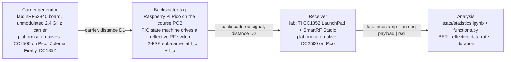

# System architecture

This page describes the system as it was used in the experiments and as it is
implemented in the university platform vendored under
[`platform/wcnes-project2026/`](../platform/wcnes-project2026/). Statements about the
laboratory setup come from the two Group 6 reports (photographs and Experimental Setup
sections); statements about firmware, radio settings and the analysis pipeline come
from the platform source code. Group 6's modified firmware is **not** in this
repository (see [provenance.md](provenance.md)), so nothing below describes their
exact register values or clock dividers.

## 1. Three-node backscatter link

| Node | In the laboratory (from the report photographs and text) | In the platform archive |
|---|---|---|
| Carrier generator | Nordic nRF52840 development board in a plastic enclosure, generating an unmodulated 2.4 GHz carrier | `carrier-nrf52840/` (serial-prompt guide), `carrier-CC2500/` (Mikroe-1435 CC2500 click on a Pico, +1 dBm max), `carrier-Firefly/`, `carrier-receiver-CC1352/` |
| Backscatter tag | The green course PCB with two antennas, driven by a Raspberry Pi Pico | `hardware/` (KiCad design, Gerbers, BOM), `baseband/` (compile-time PIO), `project_pico_libs/` (run-time PIO generation, packet generation, radio drivers) |
| Receiver | TI CC1352 LaunchPad (red board) connected to a laptop running SmartRF Studio | `carrier-receiver-CC1352/` (SmartRF settings guide), `receiver-CC2500/` (Pico + CC2500 receiver with USB log output) |

The tag never transmits on its own. It switches its antenna between an open and a
short circuit (reflection coefficient +1 or −1), which multiplies the incoming carrier
by a ±1 square wave. Switching at a baseband frequency `f_b` moves the reflected energy
to `f_c ± f_b` (plus odd harmonics). The received power therefore depends on the product
of two path losses, carrier-to-tag and tag-to-receiver, which is why the midpoint of
the carrier–receiver line is the worst case and why the reports evaluate five tag
positions along that line.

## 2. Tag: PIO-generated 2-FSK baseband

The RP2040's programmable I/O (PIO) unit toggles the RF-switch control pin(s) with
cycle-exact timing derived from the 125 MHz system clock. Two integer clock dividers
`d0` and `d1` define the toggling periods for symbol 0 and symbol 1:

* shift frequency for symbol *k*: `125 MHz / d_k` (dividers must be even);
* centre offset from the carrier: `(125 MHz/d0 + 125 MHz/d1) / 2`;
* FSK deviation: `|125 MHz/d1 − centre offset|`;
* minimum receiver filter bandwidth: `baud + 2 × deviation`.

The platform provides two ways to build the state machine:

* `baseband/generate-backscatter-pio.py` writes a `.pio` file for given
  `d0 d1 baud` at build time. The checked-in `baseband/backscatter.pio` was generated
  with `28 24 100000 --twoAntennas`: shifts of 4.464 MHz and 5.208 MHz, centre offset
  4.836 MHz, deviation 372 kHz, about 844 kHz occupied bandwidth.
* `project_pico_libs/backscatter.c` assembles the same program at run time
  (`backscatter_program_init`), so baud rate and dividers can be changed without
  recompiling. The integrated example `carrier-receiver-baseband/main.c` uses
  `CLOCK_DIV0 = 20`, `CLOCK_DIV1 = 18`, `DESIRED_BAUD = 100000`, two antennas: shifts
  of 6.25 MHz and 6.94 MHz, centre offset about 6.60 MHz, deviation about 347 kHz.

Baud rates that do not divide 125 MHz are snapped to the nearest achievable value
(for 80, 70 and 60 kBaud the snapped values differ from the nominal ones by less than
0.05 %). The library prints a warning when the deviation exceeds what the CC2500
(380 kHz) or CC1352 (1 MHz) can be configured for. The reports do not state which
dividers Group 6 used.

## 3. Frame format

Defined in `project_pico_libs/packet_generation.[ch]`:

| Field | Bytes | Content |
|---|---|---|
| Preamble | 4 | `AA AA AA AA` |
| Sync word | 4 | `93 0B 51 DE` for the CC1352 receiver, `D3 91 D3 91` for the CC2500 (`RECEIVER` macro) |
| Length | 1 | `1 + PAYLOADSIZE` = 15 (`0x0F`) with the default `PAYLOADSIZE = 14` |
| Sequence number | 1 | increments per packet, wraps at 256 |
| Payload | 14 | 2-byte pseudo-sequence (byte index into a virtual file) + six 16-bit pseudo-random "compressible" samples = 12 data bytes |

Total: 24 bytes, packed into six 32-bit words for the PIO FIFO. The samples come from a
linear congruential generator seeded with `0xABCD` and shaped into a Gaussian-like
16-bit distribution, so the analysis script can regenerate the expected payload for
any pseudo-sequence value and count bit errors without a side channel. The receiver
examples check a CRC that the tag does not append, so every line of the platform's own
sample logs ends in "CRC error"; the analysis ignores that flag.

The starter examples wait a configured `TX_DURATION` of 250 ms between packets plus a
few milliseconds of fixed delays. The on-air packet interval actually used in the
laboratory runs is not documented in the reports.

## 4. Receiver settings

* **CC2500 (platform example, `project_pico_libs/receiver_CC2500.c`)**: 2-FSK, variable
  packet length, 4-byte preamble, 30-of-32-bit sync qualifier, CRC check enabled,
  base frequency 2456.597 MHz (carrier + centre offset), data rate about 98.6 kBaud,
  deviation about 355 kHz, RX filter bandwidth 812.5 kHz. The library can re-derive
  data rate, deviation, filter bandwidth and frequency from the PIO parameters at run
  time (`set_datarate_rx`, `set_frequency_deviation_rx`, `set_filter_bandwidth_rx`,
  `set_frecuency_rx`).
* **CC1352 + SmartRF Studio (used in the laboratory)**: the operator sets base
  frequency, data rate, deviation, RX filter bandwidth and the sync word by hand in
  SmartRF's Packet RX view (`carrier-receiver-CC1352/README.md`). The receiver settings
  Group 6 used for each baud rate are not recorded in the reports.

Carrier spectra measured by the platform authors (`carrier-characteristics/`) show a
CC2500 carrier with about 1.1 MHz main-lobe bandwidth and side lobes at ±1 MHz, a
CC1352P7 carrier of about 1.2 MHz and a Firefly carrier of about 0.9 MHz. No
measurement of the nRF52840 carrier is included.

## 5. Measurement and analysis pipeline

1. The receiver prints one line per accepted packet:
   `HH:MM:SS.mmm | <len> <seq> <payload bytes in hex> | <rssi> CRC pass|error`.
   `carrier-receiver-baseband/serial-print.py` captures such lines to a file.
2. `stats/functions.py` parses the log, regenerates the expected payload from the
   pseudo-sequence field and counts differing bits (`popcount` of the XOR).
3. `stats/statistics.ipynb` reports:
   * **BER** over received packets (missing packets do not enter the BER);
   * **file delay** = timestamp of the last received packet − timestamp of the first;
   * a **data rate** = received packets × 12 data bytes ÷ file delay. The notebook prints
     it with the label `bit/s`; the quantity it computes is **bytes per second**, and the
     Group 6 reports use bytes/s throughout;
   * a **distance metric** `D1² · D2²` and a radar plot against course reference values.

The reports add a run-duration metric (identical in definition to the file delay) and,
in Optimisation 2, a packet reception rate; see [experiments.md](experiments.md).
