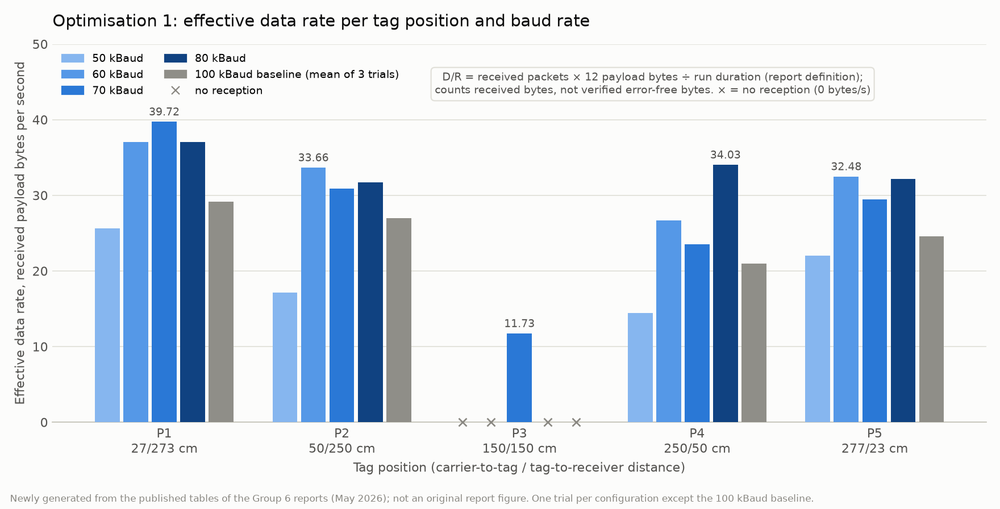
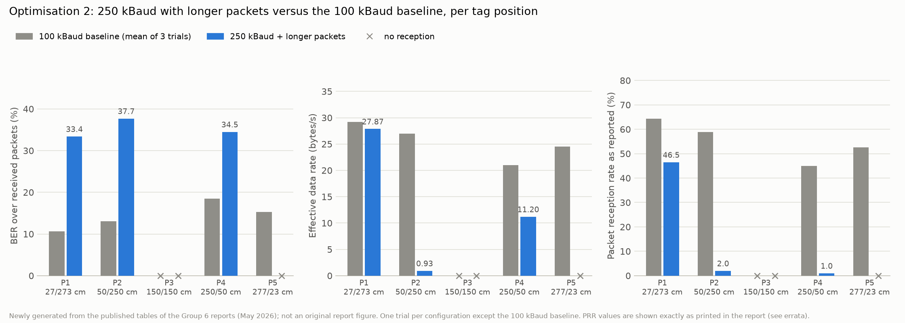

# Results

All numbers on this page come from the tables published in the two Group 6 reports
([`reports/`](reports/)). Part 1 reproduces those tables as printed. Part 2 shows
summaries **newly computed** from them by [`analysis/summarize.py`](../analysis/summarize.py)
(the tables below are copied from `analysis/output/`; re-run the script to regenerate
them). Part 3 shows figures **newly generated** by [`analysis/plot.py`](../analysis/plot.py).
Part 4 states what the evidence supports. Caveats that apply throughout: one trial per
optimised configuration (the baseline is a mean of three); BER is computed over received
packets only; "effective data rate" counts received payload bytes whether or not they
contain errors; the reports' "BER = 100 %" entry marks *no reception* and is never
averaged here as a bit-error ratio. See [limitations-and-errata.md](limitations-and-errata.md).

## 1. Tables as printed in the reports

### 1.1 Optimisation 1, Table 1 (report page 4)

| Config | Trials | Position | Reception | BER % as printed | D/R bytes/s as printed | Duration s as printed |
|---|---|---|---|---|---|---|
| 100k | 3 | P1 | received | 10.66 | 29.16 | 84.42 |
| 100k | 3 | P2 | received | 13.03 | 26.95 | 89.52 |
| 100k | 3 | P3 | none | 100.00 | 0.00 | — |
| 100k | 3 | P4 | received | 18.51 | 20.99 | 116.32 |
| 100k | 3 | P5 | received | 15.33 | 24.55 | 97.89 |
| 80k | 1 | P1 | received | 4.30 | 37.03 | 64.81 |
| 80k | 1 | P2 | received | 10.00 | 31.71 | 75.68 |
| 80k | 1 | P3 | none | 100.00 | 0.00 | — |
| 80k | 1 | P4 | received | 8.16 | 34.03 | 70.52 |
| 80k | 1 | P5 | received | 6.95 | 32.15 | 74.64 |
| 70k | 1 | P1 | received | 3.72 | 39.72 | 60.66 |
| 70k | 1 | P2 | received | 9.70 | 30.87 | 77.75 |
| 70k | 1 | P3 | received | 29.96 | 11.73 | 204.53 |
| 70k | 1 | P4 | received | 15.00 | 23.49 | 102.14 |
| 70k | 1 | P5 | received | 11.94 | 29.48 | 81.39 |
| 60k | 1 | P1 | received | 3.57 | 37.03 | 64.79 |
| 60k | 1 | P2 | received | 8.64 | 33.66 | 71.28 |
| 60k | 1 | P3 | none | 100.00 | 0.00 | — |
| 60k | 1 | P4 | received | 10.97 | 26.68 | 89.44 |
| 60k | 1 | P5 | received | 8.25 | 32.48 | 73.88 |
| 50k | 1 | P1 | received | 11.50 | 25.64 | 93.58 |
| 50k | 1 | P2 | received | 14.40 | 17.17 | 139.72 |
| 50k | 1 | P3 | none | 100.00 | 0.00 | — |
| 50k | 1 | P4 | received | 18.45 | 14.44 | 166.16 |
| 50k | 1 | P5 | received | 14.69 | 22.02 | 108.09 |

### 1.2 Optimisation 1, Table 2 (report page 5)

| Config | Avg BER % as printed | Avg D/R bytes/s as printed | Avg duration s as printed |
|---|---|---|---|
| 100k | 31.51 | 20.33 | 97.04 |
| 80k | 25.88 | 26.98 | 71.41 |
| 70k | 14.06 | 27.06 | 105.30 |
| 60k | 26.29 | 25.97 | 74.85 |
| 50k | 31.81 | 15.85 | 126.89 |

Stated method: BER and D/R averaged over all five positions with P3 failures entered as
BER = 100 % and D/R = 0; duration averaged only over positions where packets were received.

### 1.3 Optimisation 2, Table 1 (report page 4)

| Config | Trials | Position | Reception | BER % as printed | D/R bytes/s as printed | PRR % as printed |
|---|---|---|---|---|---|---|
| 100k (baseline) | 3 | P1 | received | 10.66 | 29.16 | 64.3 |
| 100k (baseline) | 3 | P2 | received | 13.03 | 26.95 | 58.8 |
| 100k (baseline) | 3 | P3 | none | 100.00 | 0.00 | — |
| 100k (baseline) | 3 | P4 | received | 18.51 | 20.99 | 45 |
| 100k (baseline) | 3 | P5 | received | 15.33 | 24.55 | 52.5 |
| 250k and increased packet length | 1 | P1 | received | 33.4 | 27.87 | 46.5 |
| 250k and increased packet length | 1 | P2 | received | 37.7 | 0.93 | 2 |
| 250k and increased packet length | 1 | P3 | none | 100.00 | 0.00 | — |
| 250k and increased packet length | 1 | P4 | received | 34.5 | 11.2 | 1 |
| 250k and increased packet length | 1 | P5 | none | 100.00 | 0.00 | — |

Notes recorded during transcription: the P2 data rate of the 250k configuration is
printed as ".93"; the P4 pair (11.2 bytes/s, 1 %) is preserved although it is not
self-consistent under the report's definitions; the table has no duration column.

## 2. Newly computed summaries

### 2.1 The reports' Table 2 method re-applied

The report's Table 2 averages BER and D/R over all five positions **with the
"BER = 100 %, D/R = 0" failure marker entered for positions without reception**
("sentinel-inclusive"), and averages duration only over positions with reception.
Re-applying that method to the published Table 1 values gives:

| Config | Avg BER % (sentinel-inclusive), recomputed | Table 2 | Avg D/R bytes/s, recomputed | Table 2 | Avg duration s, recomputed | n positions | Table 2 |
|---|---|---|---|---|---|---|---|
| 100k | 31.51 | 31.51 | 20.33 | 20.33 | 97.04 | 4 | 97.04 |
| 80k | 25.88 | 25.88 | 26.98 | 26.98 | 71.41 | 4 | 71.41 |
| 70k | 14.06 | 14.06 | 27.06 | 27.06 | 105.29 | 5 | 105.30 |
| 60k | 26.29 | 26.29 | 25.97 | 25.97 | 74.85 | 4 | 74.85 |
| 50k | 31.81 | 31.81 | 15.85 | 15.85 | 126.89 | 4 | 126.89 |

All values agree with the report's Table 2 to two decimals except the 70k mean
duration, where the published Table 1 values give 105.29 s against
105.30 s in Table 2 (difference -0.006 s). The cause of the
small discrepancy is not established from the published material (rounding of the
per-position values before averaging is one possibility). Note that the 70k duration
average covers five positions while the other four cover four, so that column is not
like-for-like across configurations.

The sentinel-inclusive BER average mixes measured bit-error ratios with an artificial
100 % marker and should not be read as a bit-error ratio. The D/R average is different in
kind: a data rate of 0 bytes/s at a position without reception is a legitimate
throughput outcome, so the D/R average does reflect coverage.

### 2.2 Unweighted means over the four common positions

These are the four positions with reception in **every compared configuration**, so no
failure marker enters the average. Unweighted arithmetic means across the four positions:

| Config | Trials / position | Mean BER % (P1,P2,P4,P5) | BER range % | Mean D/R bytes/s | Mean duration s |
|---|---|---|---|---|---|
| 100k | 3 | 14.38 | 10.66–18.51 | 25.41 | 97.04 |
| 80k | 1 | 7.35 | 4.30–10.00 | 33.73 | 71.41 |
| 70k | 1 | 10.09 | 3.72–15.00 | 30.89 | 80.48 |
| 60k | 1 | 7.86 | 3.57–10.97 | 32.46 | 74.85 |
| 50k | 1 | 14.76 | 11.50–18.45 | 19.82 | 126.89 |

Lowest mean BER over the common positions: **80k** (7.35 %).
Shortest mean duration over the common positions: **80k** (71.41 s).

### 2.3 Best configuration at each position

| Position | Configs with reception | Lowest BER | Runner-up | Highest D/R | Shortest duration |
|---|---|---|---|---|---|
| P1 | 5 | 60k (3.57 %) | 70k (3.72 %) | 70k (39.72 bytes/s) | 70k (60.66 s) |
| P2 | 5 | 60k (8.64 %) | 70k (9.70 %) | 60k (33.66 bytes/s) | 60k (71.28 s) |
| P3 | 1 | 70k (29.96 %) | — | 70k (11.73 bytes/s) | 70k (204.53 s) |
| P4 | 5 | 80k (8.16 %) | 60k (10.97 %) | 80k (34.03 bytes/s) | 80k (70.52 s) |
| P5 | 5 | 80k (6.95 %) | 60k (8.25 %) | 60k (32.48 bytes/s) | 60k (73.88 s) |

The configuration with the best common-position average is not the best at every
position: rankings differ between the carrier-side (P1, P2) and receiver-side (P4, P5)
positions.

### 2.4 Midpoint outcomes

| Config | Midpoint P3 outcome | BER % | D/R bytes/s | Duration s |
|---|---|---|---|---|
| 100k | no packets received within the 5-minute cap (report marker: BER = 100 %, D/R = 0) | not measurable | 0.00 | — |
| 80k | no packets received within the 5-minute cap (report marker: BER = 100 %, D/R = 0) | not measurable | 0.00 | — |
| 70k | packets received | 29.96 | 11.73 | 204.53 |
| 60k | no packets received within the 5-minute cap (report marker: BER = 100 %, D/R = 0) | not measurable | 0.00 | — |
| 50k | no packets received within the 5-minute cap (report marker: BER = 100 %, D/R = 0) | not measurable | 0.00 | — |

The 70k midpoint reception is a genuine coverage result: it is the only configuration
that delivered packets at the worst-case position, with a BER of about 30 % and a
run of 204.53 s. The other configurations' P3 entries are failure markers, not
measurements.

### 2.5 Optimisation 2 against the baseline

| Position | Baseline BER % | 250k BER % | BER ratio | Baseline D/R | 250k D/R | Baseline PRR % | 250k PRR % |
|---|---|---|---|---|---|---|---|
| P1 | 10.66 | 33.4 | 3.13 | 29.16 | 27.87 | 64.3 | 46.5 |
| P2 | 13.03 | 37.7 | 2.89 | 26.95 | 0.93 | 58.8 | 2.0 |
| P3 | no reception | no reception | — | 0.00 | 0.00 | — | — |
| P4 | 18.51 | 34.5 | 1.86 | 20.99 | 11.20 | 45.0 | 1.0 |
| P5 | 15.33 | no reception | — | 24.55 | 0.00 | 52.5 | — |

At P1 the 250k data rate (27.87 bytes/s) is close to but lower than the
baseline (29.16 bytes/s). BER rose at every position with reception, by a factor of 3.13, 2.89, 1.86 at P1, P2, P4 respectively; P3 and P5 received nothing.
The PRR values are preserved as printed. Two diagnostic columns in
`opt2_baseline_vs_250k_comparison.csv` compute PRR/100 × 12 bytes ÷ D/R, which under
the report's stated quantities equals the implied inter-packet interval **if** PRR is
read as expected time ÷ actual time and a 12-byte payload entered the D/R formula. It
is about 0.26 s for every baseline row and for 250k P2, about 0.20 s for 250k P1, and
about 0.01 s for 250k P4; the P4 pair is therefore not self-consistent under those
readings. The report does not state the payload length used in D/R for the 250k
configuration, and no on-air packet interval is documented, so these are diagnostics,
not corrections.

The complete set of generated tables, including the per-position rankings and the
approximate packet-count consistency check, is in
[`analysis/output/summary.md`](../analysis/output/summary.md).

## 3. Figures

All four figures are newly generated from the transcribed tables; they are not the
figures printed in the reports. Positions without reception are drawn as × markers on
the baseline, never as 100 % bars.

*Figure 1. Optimisation 1: bit error rate over received packets per tag position, for
the five baud rates. Only 70 kBaud received packets at the midpoint P3. Newly generated
from Table 1 of the Optimisation 1 report.*

*Figure 2. Optimisation 1: effective data rate (received payload bytes per second, the
report's definition) per tag position and baud rate. Newly generated from Table 1 of
the Optimisation 1 report.*

*Figure 3. Optimisation 1: unweighted means of BER, effective data rate and run duration
over the four positions with reception in every compared configuration (P1, P2, P4, P5),
against baud rate. The grey point is the 100 kBaud baseline. Newly generated from
Table 1 of the Optimisation 1 report.*

*Figure 4. Optimisation 2: BER, effective data rate and packet reception rate per tag
position for the 100 kBaud baseline and the 250 kBaud configuration with longer packets.
PRR values are shown exactly as printed in the report. Newly generated from Table 1 of
the Optimisation 2 report.*

## 4. What the evidence supports

Tags: **[measured]** = value printed in a report; **[computed]** = derived here from the
printed tables; **[proposal]** = analytical reasoning, not measured.

1. **[measured]** Lowering the baud rate from 100 kBaud to 60–80 kBaud reduced BER at every
   position where packets were received: P1 10.66 → 4.30 (80k) / 3.57 (60k) %,
   P2 13.03 → 10.00 / 8.64 %, P4 18.51 → 8.16 / 10.97 %, P5 15.33 → 6.95 / 8.25 %.
2. **[computed]** Over the four positions with reception in every compared configuration
   (P1, P2, P4, P5), 80 kBaud has the lowest unweighted mean
   BER (7.35 %), the highest mean data rate (33.73 bytes/s) and the shortest mean run
   (71.41 s), with 60 kBaud close behind (7.86 %, 32.46 bytes/s, 74.85 s). The two are
   within single-trial variation of each other.
3. **[measured]** The best configuration differs by position: 60 kBaud has the lowest BER
   at P1 and P2, 80 kBaud at P4 and P5; 70 kBaud has the highest data rate at P1.
4. **[measured]** 70 kBaud was the only configuration to receive packets at the midpoint
   P3: BER 29.96 %, 11.73 bytes/s, 204.53 s. This is a real coverage result on a marginal
   link; the other configurations' midpoint entries are failure markers.
5. **[measured]** 50 kBaud reversed the improvement (mean edge BER 14.76 %, 19.82 bytes/s,
   126.89 s), so the relationship between baud rate and reliability is not monotonic
   over the range tested.
6. **[measured]** 250 kBaud with longer packets did not improve on the baseline: BER rose
   at every reached position (factors 3.13, 2.89 and 1.86 at P1, P2 and P4), P3 and P5
   received nothing, PRR at P2 and P4 was 1–2 % as printed, and the P1 data rate was close
   to but below baseline (27.87 vs 29.16 bytes/s).
7. **[proposal]** Packet-level FEC with interleaving could improve delivered payload
   reliability where packets are received but corrupted, including the marginal 70 kBaud
   midpoint reception, at a cost in throughput, latency and tag memory; it cannot recover
   packets that were never detected, and no implementation or simulation exists. See
   [analytical-optimisation.md](analytical-optimisation.md).
